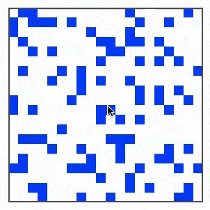

This project demonstrates an implementation of[ Conway's Game of Life](http://en.wikipedia.org/wiki/Conway's_Game_of_Life) using functional concepts.

You can read much more about this project in the [accompanying blog post](http://www.scottlogic.com/blog/2014/09/10/game-of-life-in-functional-swift.html).

For a quick taster, the following snippet shows how the rules of Life are implemented within this code:

    // rules of life
    let liveCells = cells.filter { $0.state == .Alive }
    let deadCells = cells.filter { $0.state != .Alive }
    
    let dyingCells = liveCells.filter { livingNeighboursForCell($0) !~= 2...3 }
    let newLife =  deadCells.filter { livingNeighboursForCell($0) == 3 }
    
    // updating the world state
    newLife.each { (cell: Cell) in cell.state = .Alive }
    dyingCells.each { (cell: Cell) in cell.state = .Dead }
